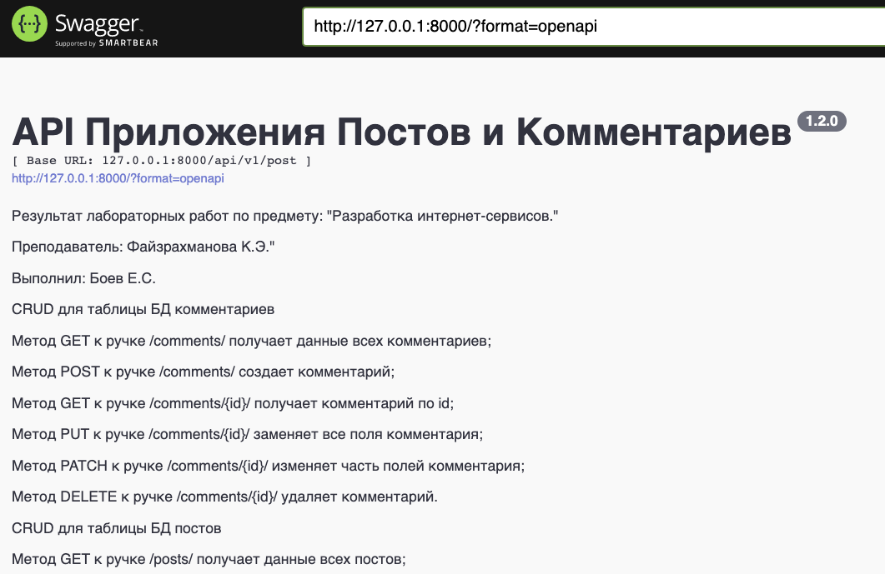

# API Приложения Постов и Комментариев

[](https://www.python.org/)
[](https://www.djangoproject.com/)


## Описание

Результат лабораторных работ по предмету: "Разработка интернет-сервисов."

Преподаватель: Файзрахманова К.Э.

Выполнил: Боев Е.C.

## Функционал

- Просмотр постов, их создание, удаление и изменение;
- Комментирование постов, просмотр, удаление и обновление комментариев.


## Установка

1. Клонировать репозиторий:

    ```python
    https://github.com/egorcoders/internet_service_development
    ```

2. Перейти в папку с проектом:

    ```python
    cd internet_service_development/
    ```

3. Установить виртуальное окружение для проекта:

    ```python
    # для OS Lunix и MacOS
    python3 -m venv venv
    
    # для OS Windows
    python -m venv venv
    ```

4. Активировать виртуальное окружение для проекта:

    ```python
    # для OS Lunix и MacOS
    source venv/bin/activate
    
    # для OS Windows
    source venv/Scripts/activate
    ```

5. Установить зависимости:

    ```python
    python3 -m pip install --upgrade pip
    pip install -r requirements.txt
    ```

6. Выполнить миграции на уровне проекта:

    ```python
    cd yatube
    python3 manage.py makemigrations
    python3 manage.py migrate
    ```

7. Запустить проект:

    `python manage.py runserver`

## Управление API проекта


Для работы с API, необходимо перейти по ссылке локально развернутого проекта:

```python
http://127.0.0.1:8000/
```

## Пример запроса

Создание комментария

Отправить POST-запрос на адрес `http://127.0.0.1:8000/api/v1/post/comments/`, нажав 
"Try it out -> Execute" и передать обязательные поля `post` и `message`.


1. Пример запроса:

    ```json
    {
      "post": 1, // Номер поста
      "message": "Текст комментария"
    }
    ```
   

2. Пример ответа:

    ```json
    {
      "id": 6, // Номер комментария
      "post": 1, // Номер поста
      "message": "Текст комментария",
      "created_at": "2022-10-01T07:26:41.019937Z", // Дата создания
      "updated_at": "2022-10-01T07:26:41.019977Z" // Дата редактирования
    }
    ```
   

## Доступ к БД проекта


Для того, чтобы получить доступ к БД проекта, необходимо:

1. Создать суперпользователя с именем, почтой и паролем:
    ```python
    python3 manage.py createsuperuser
    ```

2. Открыть проект для администрирования:
    ```python
    http://127.0.0.1:8000/admin/
    ```
